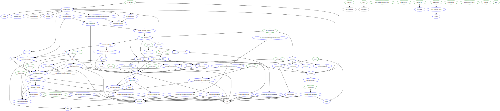

# Chjize

This changes a pristine Debian (or possibly Ubuntu or Cygwin (at least
the chj-perllib target works)) install in ways that I like, including
software installs and configuration modifications.

Currently uses cryptographic signatures without exception to ensure
code integrity.

## How to use

Note: you can get a script [here](install) that runs the same as the
following. How it is meant to be used is, you check out chjize on your
developer machine, and then when you want to install chjize on another
machine you copy over the script and then run it instead of copying
these instructions.

As root:

    apt-get update
    apt-get install -y git make gnupg
    mkdir -p /opt/chj
    cd /opt/chj
    git clone https://github.com/pflanze/chjize.git
    cd chjize/
    
You can verify via signed git tags that you've got the pristine source
(note that most rules import the key to gpg, too, and as the key is
included in the repository, this means that if you got a trusted
checkout of this repository then this verification step can be
skipped; it will properly check signatures of other repositories it
fetches in any case):

    gpg --import cj-key.asc
    version=r$(git tag -l | grep ^r | sed s/^r// | LANG=C sort -rn | head -1)
    git checkout -b local "$version"
    tmptag=$(mktemp)
    git tag -v "$version" > "$tmptag" 2>&1 || { cat "$tmptag"; false; }
    cat "$tmptag"
    # Check that the above command gives "Good signature", and (if warning) shows
    #   my fingerprint (A54A1D7CA1F94C866AC81A1F0FA5B21104EDB072, feel 
    #   free to google it) if you don't have a trust path to the key.
    if grep -q WARNING "$tmptag"; then grep "A54A 1D7C A1F9 4C86 6AC8.*1A1F 0FA5 B211 04ED B072" "$tmptag"; fi
    
    # You can also do the more paranoid verification of running the
    #   script lines shown in the tag (the lines starting with a `$`),
    #   and verifying that you get the same output as shown:
    sumsSig=$(perl -we 'local $/; $a=<STDIN>; $a=~ s{.*\n\$[^\n]*sha256sum\n}{}s; print $a' < "$tmptag")
    sumsLocal=$(git ls-files -z | xargs -0 --no-run-if-empty -s 129023 -n 129023 sha256sum)
    if ! diff <(echo "$sumsSig") <(echo "$sumsLocal"); then echo "check failure"; false; fi

Once you trust that the source is mine, run:
    
    PATH=/opt/chj/chjize/bin:$PATH
    chjize -h

for the list of available targets (the same as shown
[below](#current-list-of-targets)). To e.g. only install my software
into `/opt/chj` (and dependences, see `targets.mk` or the
[graph](#graph-of-target-dependencies) below), run:

    chjize chj

Unlike Ansible, this caches which actions were already done, and is
thus more efficient when asking the same target repeatedly (even
across runs). If an action for some reason really should be re-run,
unlink the file with the same name as the target.

May work with parallel builds (`-j2` etc.), since we're now using
wrappers around `apt-get` and `apt` (in [bin/](bin/)) that use waiting
locks.

## Client side automation

To set up servers, some more client side automation is desirable. For
an example (just a recipe) see
[client-side-todo](client-side-todo.md).

## Current list of targets

(Note: these are copied from [`targets.mk`](targets.mk) via `chjize README.md`.)

### graph-deps

Install dependencies to run the `graph` target.

### key

Import cj-key.asc into the keyring of the current user.

### perhaps_aptupdate

Run `apt-get update` unless already run in the last 24 hours.

### debian_upgrade

Upgrade the system (via dist-upgrade), necessary on a fresh instance
on typical cloud hostings like Amazon's.

### urxvt

Install `rxvt-unicode` and trim it down for security and simplicity.

### debianpackages

Install my preferred Debian packages.

### cplusplus

Install `g++`.

### git-sign

Check out [git-sign](https://github.com/pflanze/git-sign); used by
most other targets.

### chj-perllib-checkout

### chj-perllib

### chj-bin

Install [chj-bin](https://github.com/pflanze/chj-bin).

### chj-emacs-checkout

### chj-emacs

Install [chj-emacs](https://github.com/pflanze/chj-emacs) in
/opt/chj/emacs/.

### debian-emacs

Install GNU Emacs via APT.

### emacs

Install debian-emacs and chj-emacs targets.

### chj-fastrandom

### fastrandom

Install [fastrandom](https://github.com/pflanze/fastrandom).

### cj-git-patchtool

Install [cj-git-patchtool](https://github.com/pflanze/cj-git-patchtool).

### locales

Automatically configure some (English and German speaking) locales.

### debconf-noninteractive

Automatically configure debconf to be in Noninteractive mode (run
this to avoid other targets waiting for inputs; also, it will be the
only mode that works with -j2).

### chj

Check out the last tagged versions of various repositories into
`/opt/chj` (uses signed tags via git-sign to ensure you get what I
signed)

### dotconfig-xfce4-checkout

Check out [Xfce4 .config
files](https://github.com/pflanze/dotconfig-xfce4), which are used
by [xfce-setup](bin/xfce-setup).

### xfce

Xfce4 desktop. Comes with `/opt/chj/chjize/bin/xfce-setup` to
configure Xfce4 the way I like (optionally run afterwards). NOTE:
better do not use this target directly, but rather use
`xfce4_load_profile` or one of the `..-desktop` ones.

### xfce4_load_profile

### load_profile

Set up Debian so that a graphical login will read the `~/.profile`
file (which they stopped doing at some point, dunno why); currently
only implemented for Xfce.

### moduser

Modify the `/root`, `/etc/skel`, and if present `/home/chris`
directories to use a checkout of
[chj-home](https://github.com/pflanze/chj-home); it should safely
store previous versions of your files in the Git repository that's
at this place before checking out my versions, see them via `gitk
--all`. This also sets up emacs to work nicely with Gambit, see
below. Note: if there is a `.git` directory in those directories
before, it will ask whether to continue by first moving those to
`/root/.trash/`.

If you want to modify a particular user's home without affecting the
other users, instead run `/opt/chj/chjize/bin/mod-user` as that user
(in its home dir)

### fperl

Install the [Functional Perl](http://functional-perl.org) library
and its dependencies. WARNING: not fully secured by signatures as it
downloads packages from CPAN whithout verifying signatures (which
most packages don't even have). Note: requires you to enter `yes` a
few times.

### gambit-checkout

### gambit

Install a patched version of the Gambit Scheme system.

### qemu

Install Qemu, and
[cj-qemucontrol](https://github.com/pflanze/cj-qemucontrol).

### slim-desktop

Xfce4, desktop packages.

### full-desktop

`slim-desktop`, but also removes pulseaudio and installs jack, and
removes the login managers. Xfce4 has to be started via `startx`
from the console after this! (That latter part was a hack to work
around some issues in Debian stretch / get what I wanted.)

### full-desktop_autoremove

The `full-desktop` target but also runs `apt-get autoremove` to free
up the space taken by now unused packages.

### dnsresolver

Install and configure a local dns resolver (unbound).

### mercurial

Install mercurial, and hg-fast-export from either Debian or upstream
source.

### system

Ensure basic system readyness.

### slim-vncserver

Server side VNC setup, to be used via client side VNC
setup. Currently assumes a single user will be used to run the VNC
server as (hard codes ports).

### full-vncserver

Server with VNC and Xfce4 desktop plus common chj packages. Note the
message about finishing the setup.

### vncclient

Client side VNC setup.

### swap

Create and activate (including adding to fstab) a swap file if none
is already active. Size is automatically chosen to be the same as
the RAM size or enough to give a total of RAM+swap of 3 GB.

### virtualmem_3GB

Enable swap if there is less than 3 GB of RAM available. (Only
provides 3 GB of virtual memory if there is at least 1 GB of RAM!
But with 512 MB of RAM Gambit compilation would be swapping so much
that more swap wouldn't be helpful anyway, so leave it at just what
the `swap` target provides.)

### nosudo

Remove `sudo` (often provided by images) since it's a security
issue. Since this will lock you out from acting as root unless you
have enabled corresponding access, you have to set
`SUDO_FORCE_REMOVE=yes` before running this target or it will
fail. If instead you want to keep `sudo` installed, set `NOSUDO=no`.

### nosudo-auto

Runs the `nosudo` target except it will force removal even without
`SUDO_FORCE_REMOVE=yes` if it can ensure that the root login can be
used: either since root was not logged in via sudo, or, it is an ssh
login, in which case the authorized_keys are copied to the root
account--NOTE that this still will you lock out if you actually log
in via password instead of a key! Still is a NOP if `NOSUDO=no` is
set.

### set-x-terminal-emulator

Set `x-terminal-emulator` in Debian's alternatives system to
`/opt/chj/bin/term`, which uses urxvt.

### firefox

Install Firefox from Debian.

### unison

Install unison from Debian (console version).

### guix

Install guix from Debian. Upgrades system to Debian Bullseye!

### schemen-user

Create `schemen` user, copy ssh keys from root to it.

### schemen-lili

Check out and build [lili](https://github.com/pflanze/lili) as the
`schemen` user.

### schemen

Full set up of a VNC server for Scheme mentoring. Requires VNC
passwd file, first run on server: `( umask 077; mkdir tmp )` then
on your desktop: `scp .vncclient-passwords/passwd
root@tmp:/opt/chj/chjize/tmp/`.

### schemen-finish

### remove-xserver

Remove xorg and xserver-xorg packages. This is a horrible HACK for
cases where they should never be installed in the first place but I
can't figure out why they are. (This is called from within the
slim-desktop rule.)

### sources-bullseye

Changes /etc/apt/sources.list to point to bullseye instead of buster

### bullseye

Upgrade a Debian system running Buster to Bullseye

## Graph of target dependencies

The targets meant to be used manually are shown in green (not used by
other targets) and blue (used by others).

